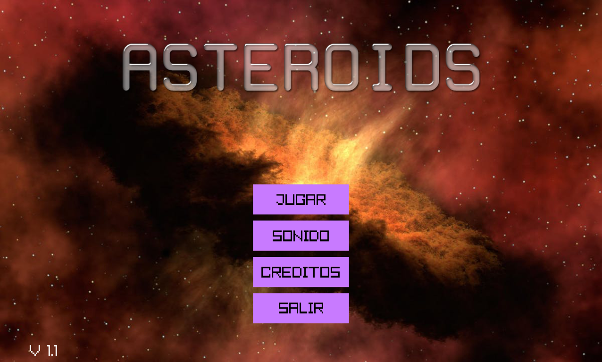
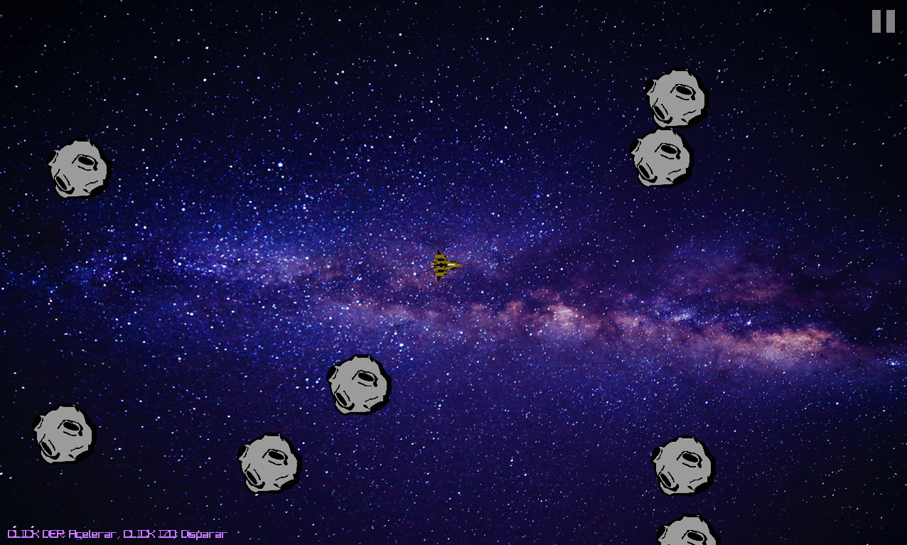
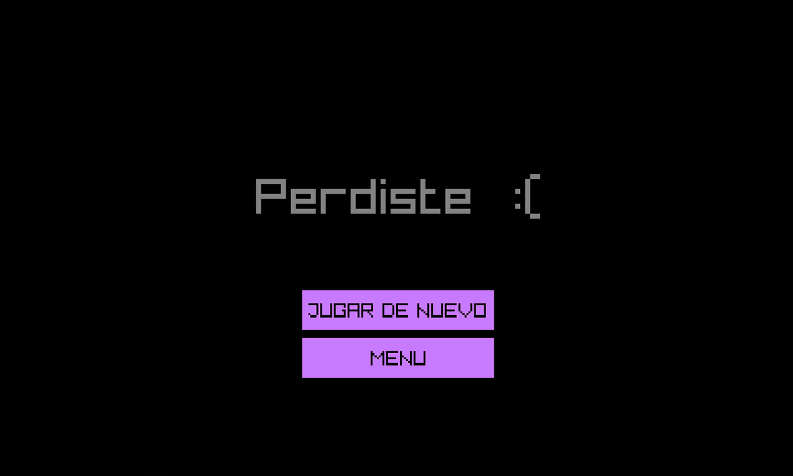

# Asteroids

## Logo:

## Descripcion:
Juego basado en el clasico Asteroids, popular videojuego de arcade basado en vectores lanzado en 1979 por Atari.

## Screenshot:

## Musica: 
- Realizada con BoscaCeoil.

## Sonidos:
- Realizados con Bfxr.

## Autor: 
- Mariano Martinez.

## Contacto: 
- mariano_mcr92@hotmail.com
- marianomcr92@gmail.com
